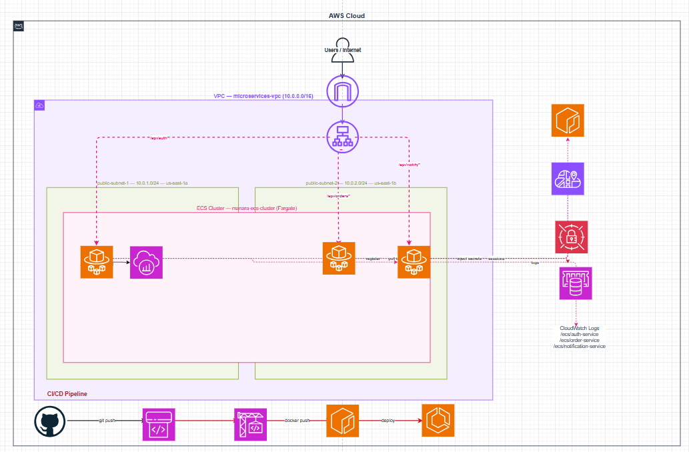

# Containerized Microservices with ECS Fargate & Service Discovery

A production-style microservices architecture built on AWS, migrating a monolithic Node.js application into three independent services running on Amazon ECS Fargate. Services communicate via AWS Cloud Map for DNS-based service discovery, with an Application Load Balancer handling all external traffic.

---

## Architecture Diagram



---

## Architecture Overview

```
Internet
    │
    ▼
Application Load Balancer (microservices-alb)
    │
    ├── /api/auth*    ──► ECS Fargate: Auth Service        (port 3001)
    ├── /api/orders*  ──► ECS Fargate: Orders Service      (port 3002)  ──► Auth (via ALB)
    └── /api/notify*  ──► ECS Fargate: Notifications Svc   (port 3003)
              │
              ├── AWS Cloud Map  (microservices.local)
              ├── ElastiCache Redis  (shared session cache)
              └── Secrets Manager   (runtime secret injection)

CI/CD:  GitHub → CodePipeline → CodeBuild → ECR → ECS Rolling Deploy
Observability:  X-Ray daemon sidecar on every task
```

---

## AWS Services Used

| Service | Purpose |
|---|---|
| **ECS Fargate** | Run containers without managing servers |
| **ECR** | Private container registry with vulnerability scanning |
| **ALB** | Path-based routing to multiple microservices |
| **AWS Cloud Map** | DNS-based service discovery between containers |
| **Secrets Manager** | Inject credentials at runtime, no hardcoding |
| **ElastiCache Redis** | Shared session store across stateless containers |
| **CodePipeline + CodeBuild** | CI/CD pipeline with automated container builds |
| **CloudWatch** | Container logs for all three services |
| **AWS X-Ray** | Distributed tracing via sidecar daemon container |
| **VPC + Security Groups** | Network isolation with SG chaining |

---

## Project Structure

```
microservices-ecs/
├── auth-service/
│   ├── app.js
│   ├── package.json
│   └── Dockerfile
├── orders-service/
│   ├── app.js
│   ├── package.json
│   └── Dockerfile
├── notifications-service/
│   ├── app.js
│   ├── package.json
│   └── Dockerfile
├── buildspec.yml
└── appspec.yml
```

---

## Phase 1 — VPC & Networking

### Why This Setup

The ALB needs to be publicly accessible, while ECS tasks should only receive traffic from the ALB — not directly from the internet. This is enforced using Security Group chaining.

### Resources Created

**VPC**
- Name: `microservices-vpc`
- CIDR: `10.0.0.0/16` — provides ~65,000 private IP addresses

**Subnets** — two public subnets across two Availability Zones (ALB requires minimum two AZs)

| Name | CIDR | AZ |
|---|---|---|
| `public-subnet-1` | `10.0.1.0/24` | us-east-1a |
| `public-subnet-2` | `10.0.2.0/24` | us-east-1b |

Both subnets have **auto-assign public IPv4** enabled so Fargate tasks can reach ECR to pull images.

**Internet Gateway**
- Name: `microservices-igw`
- Attached to `microservices-vpc`

**Route Table**
- Name: `public-rt`
- Route: `0.0.0.0/0 → microservices-igw`
- Associated with both public subnets

### Security Groups

**`sg-alb`** — attached to the Application Load Balancer

| Direction | Port | Source |
|---|---|---|
| Inbound | 80 (HTTP) | `0.0.0.0/0` |
| Outbound | All | `0.0.0.0/0` |

**`sg-ecs`** — attached to all three ECS tasks

| Direction | Port | Source |
|---|---|---|
| Inbound | 3001 | `sg-alb` |
| Inbound | 3002 | `sg-alb` |
| Inbound | 3003 | `sg-alb` |
| Outbound | All | `0.0.0.0/0` |

> Using `sg-alb` as the source (instead of an IP range) is called **SG chaining** — ECS tasks only accept traffic from the ALB, never directly from the internet.

**`sg-redis`** — attached to ElastiCache

| Direction | Port | Source |
|---|---|---|
| Inbound | 6379 | `sg-ecs` |

---

## Phase 2 — ECR Repositories

Three private repositories created in Amazon ECR with **vulnerability scanning on push** enabled.

| Repository | Image |
|---|---|
| `auth-service` | Node.js auth microservice |
| `order-service` | Node.js orders microservice |
| `notification-service` | Node.js notifications microservice |

### Dockerfile (same pattern for all three services)

```dockerfile
FROM node:18-alpine

WORKDIR /app

COPY package.json .
COPY app.js .

RUN npm install

EXPOSE 3001

CMD ["node", "app.js"]
```

### Build & Push Commands

```bash
# Authenticate to ECR
aws ecr get-login-password --region us-east-1 | \
  docker login --username AWS --password-stdin \
  <ACCOUNT_ID>.dkr.ecr.us-east-1.amazonaws.com

# Build, tag, and push each service
docker build -t auth-service .
docker tag auth-service:latest <ACCOUNT_ID>.dkr.ecr.us-east-1.amazonaws.com/auth-service:latest
docker push <ACCOUNT_ID>.dkr.ecr.us-east-1.amazonaws.com/auth-service:latest
```

---

## Phase 3 — ECS Cluster & Task Definitions

### ECS Cluster

- Name: `manara-ecs-cluster`
- Infrastructure: **AWS Fargate** — no EC2 instances to manage

### IAM Roles

ECS uses two separate roles with different purposes:

| Role | Used By | Permissions |
|---|---|---|
| **Task Execution Role** | ECS agent | Pull images from ECR, write logs to CloudWatch |
| **Task Role** | App inside the container | Call AWS services (S3, Secrets Manager, etc.) |

**Task Execution Role** created with policy: `AmazonECSTaskExecutionRolePolicy`

### Task Definitions

Each service has its own task definition family:

| Service | Family | CPU | Memory | Port |
|---|---|---|---|---|
| Auth | `auth-service-td` | 0.25 vCPU | 0.5 GB | 3001 |
| Orders | `orders-service-td` | 0.25 vCPU | 0.5 GB | 3002 |
| Notifications | `notifications-service-td` | 0.25 vCPU | 0.5 GB | 3003 |

Each task definition specifies:
- Launch type: **Fargate**
- OS: Linux/X86_64
- Container image URI from ECR
- Port mapping
- CloudWatch log group
- Task execution role

---

## Phase 4 — Application Load Balancer & Routing

### Target Groups

Three target groups with **IP address** target type (required for Fargate, which assigns IPs rather than instance IDs):

| Target Group | Port | Health Check Path |
|---|---|---|
| `tg-auth` | 3001 | `/health` |
| `tg-orders` | 3002 | `/health` |
| `tg-notifications` | 3003 | `/health` |

### ALB Configuration

- Name: `microservices-alb`
- Scheme: **Internet-facing**
- Subnets: `public-subnet-1`, `public-subnet-2`
- Security Group: `sg-alb`

### Listener Rules (HTTP:80)

Rules are evaluated by priority — first match wins:

| Priority | Condition | Action |
|---|---|---|
| 1 | Path = `/api/auth*` | Forward to `tg-auth` |
| 2 | Path = `/api/orders*` | Forward to `tg-orders` |
| 3 | Path = `/api/notify*` | Forward to `tg-notifications` |
| Default | Any other path | Forward to `tg-auth` |

---

## Phase 5 — ECS Services

Three ECS services created inside `manara-ecs-cluster`, each running one Fargate task:

| Service | Task Definition | Target Group | Desired Tasks |
|---|---|---|---|
| `auth-service` | `auth-service-td` | `tg-auth` | 1 |
| `orders-service` | `orders-service-td` | `tg-orders` | 1 |
| `notifications-service` | `notifications-service-td` | `tg-notifications` | 1 |

**Networking configuration for each service:**
- VPC: `microservices-vpc`
- Subnets: `public-subnet-1`, `public-subnet-2`
- Security Group: `sg-ecs`
- Public IP: enabled (required for Fargate to pull ECR images)

**Deployment strategy:** Rolling update (100% min, 200% max running tasks)

### Verification

```bash
# All three endpoints return JSON responses
curl http://microservices-alb-1132179270.us-east-1.elb.amazonaws.com/api/auth/verify
curl http://microservices-alb-1132179270.us-east-1.elb.amazonaws.com/api/orders
curl http://microservices-alb-1132179270.us-east-1.elb.amazonaws.com/api/notify
```

---

## Phase 6 — AWS Cloud Map (Service Discovery)

### Why Cloud Map

Without service discovery, containers cannot find each other by name — they would need hardcoded IPs which change every time a task restarts. Cloud Map creates a private DNS namespace so services resolve each other by a stable DNS name.

### Setup

**Namespace created:**
- Name: `microservices.local`
- Type: Private DNS (API + DNS queries in VPCs)
- VPC: `microservices-vpc`
- Route 53 hosted zone automatically created

**Service registered:**
- Name: `auth`
- DNS record type: A
- TTL: 10 seconds
- Full DNS name: `auth.microservices.local`

The `auth-service` ECS service was updated to register with Cloud Map on startup. Orders service communicates with Auth using the ALB DNS as the `AUTH_SERVICE_URL` environment variable.

---

## Phase 7 — AWS Secrets Manager

### Why Secrets Manager

Hardcoding credentials in source code or environment variables is a security risk. Secrets Manager stores sensitive values and injects them into containers at runtime — the application code never sees them as plaintext in config files.

### Secret Created

- Name: `microservices/config`
- Type: Other (key/value pairs)

| Key | Description |
|---|---|
| `DB_PASSWORD` | Database password |
| `API_KEY` | External API key |
| `JWT_SECRET` | JWT signing secret |

### How Injection Works

In the ECS task definition, secrets are referenced using `ValueFrom` with the Secrets Manager ARN:

```
arn:aws:secretsmanager:us-east-1:<ACCOUNT_ID>:secret:microservices/config:DB_PASSWORD::
```

ECS pulls the secret value at container startup and injects it as an environment variable. The value is never stored in the task definition or visible in the AWS console.

**Required IAM permission added to Task Execution Role:** `SecretsManagerReadWrite`

---

## Phase 8 — ElastiCache Redis

### Why Redis

Fargate containers are stateless — if three instances of Auth Service are running, each holds its own session data in memory. A user authenticated on instance 1 would be unknown to instance 2. Redis provides a shared session store accessible by all instances.

```
Auth instance 1 ─┐
Auth instance 2 ──► Redis (shared sessions)
Auth instance 3 ─┘
```

### Configuration

- Cluster name: `microservices-redis`
- Engine: Redis OSS
- Cluster mode: Disabled
- Node type: `cache.t3.micro`
- Replicas: 0 (learning environment)
- Subnet group: `redis-subnet-group` (both public subnets)
- Security group: `sg-redis` (only accepts connections from `sg-ecs`)

The Redis endpoint is passed to containers as the `REDIS_URL` environment variable in the task definition.

---

## Phase 9 — CI/CD with CodePipeline & CodeBuild

### Pipeline Flow

```
git push to main
      │
      ▼
CodePipeline detects change (GitHub webhook)
      │
      ▼
CodeBuild — runs buildspec.yml
  • Authenticates to ECR
  • docker build
  • docker push with commit SHA as image tag
  • Outputs imagedefinitions.json
      │
      ▼
ECS Deploy — rolling update using imagedefinitions.json
```

### buildspec.yml

```yaml
version: 0.2

phases:
  pre_build:
    commands:
      - aws ecr get-login-password --region us-east-1 | docker login --username AWS --password-stdin <ACCOUNT_ID>.dkr.ecr.us-east-1.amazonaws.com
      - IMAGE_TAG=$(echo $CODEBUILD_RESOLVED_SOURCE_VERSION | cut -c1-7)

  build:
    commands:
      - cd auth-service
      - docker build -t auth-service .
      - docker tag auth-service:latest <ACCOUNT_ID>.dkr.ecr.us-east-1.amazonaws.com/auth-service:$IMAGE_TAG
      - docker tag auth-service:latest <ACCOUNT_ID>.dkr.ecr.us-east-1.amazonaws.com/auth-service:latest

  post_build:
    commands:
      - docker push <ACCOUNT_ID>.dkr.ecr.us-east-1.amazonaws.com/auth-service:$IMAGE_TAG
      - docker push <ACCOUNT_ID>.dkr.ecr.us-east-1.amazonaws.com/auth-service:latest
      - printf '[{"name":"auth-service","imageUri":"<ACCOUNT_ID>.dkr.ecr.us-east-1.amazonaws.com/auth-service:%s"}]' $IMAGE_TAG > imagedefinitions.json

artifacts:
  files:
    - imagedefinitions.json
```

### appspec.yml

Used by CodeDeploy for blue/green deployments:

```yaml
version: 0.0
Resources:
  - TargetService:
      Type: AWS::ECS::Service
      Properties:
        TaskDefinition: <TASK_DEFINITION>
        LoadBalancerInfo:
          ContainerName: "auth-service"
          ContainerPort: 3001
```

### Pipeline Configuration

- **Source:** GitHub (`microservices-ecs` repo, `main` branch) via GitHub App connection
- **Build:** CodeBuild with privileged mode enabled (required for Docker)
- **Deploy:** Amazon ECS rolling update using `imagedefinitions.json`

---

## Phase 10 — X-Ray Distributed Tracing

### Sidecar Pattern

X-Ray runs as a **sidecar container** alongside the application container in the same ECS task. The app sends trace segments to the daemon on `localhost:2000`, and the daemon batches and forwards them to the X-Ray service.

```
ECS Task
┌─────────────────────────────┐
│  app container (auth-service)│──► traces ──► xray-daemon container ──► AWS X-Ray
└─────────────────────────────┘
```

### Configuration Added to Task Definition

Second container added to `auth-service-td`:

| Field | Value |
|---|---|
| Name | `xray-daemon` |
| Image | `public.ecr.aws/xray/aws-xray-daemon:latest` |
| Port | `2000 UDP` |

**IAM permission added to Task Execution Role:** `AWSXRayDaemonWriteAccess`

Traces are viewable in **CloudWatch → X-Ray traces → Service map**.

---

## Key Concepts Learned

### Security Group Chaining
Instead of opening ports to `0.0.0.0/0`, the ECS security group only accepts traffic from `sg-alb`. This means even if the ALB's IP changes, the rule automatically follows it.

### Fargate vs EC2 Launch Type
With EC2 launch type, you manage the underlying instances (patching, scaling the cluster). With Fargate, AWS manages all infrastructure — you only define CPU/memory for each task.

### Task Execution Role vs Task Role
- **Execution role** is for ECS itself: pulling images, writing logs
- **Task role** is for your application code: reading from S3, calling Secrets Manager

### Blue/Green Deployment
CodeDeploy runs the new version (green) alongside the existing version (blue), shifts traffic, and automatically rolls back if health checks fail. Zero downtime deployments.

### Why Target Type is "IP" for Fargate
EC2-based ECS registers instances to target groups. Fargate has no instances — each task gets its own IP address, so target groups must use IP-based registration.

---

## Live Endpoints

Base URL: `http://microservices-alb-1132179270.us-east-1.elb.amazonaws.com`

| Endpoint | Service | Response |
|---|---|---|
| `GET /api/auth/verify` | Auth | Token verification result |
| `GET /api/orders` | Orders | Order list + auth verification |
| `GET /api/notify` | Notifications | Notification send confirmation |
| `GET /health` | Any | `{"status": "healthy"}` |
